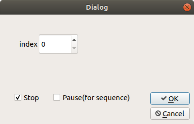
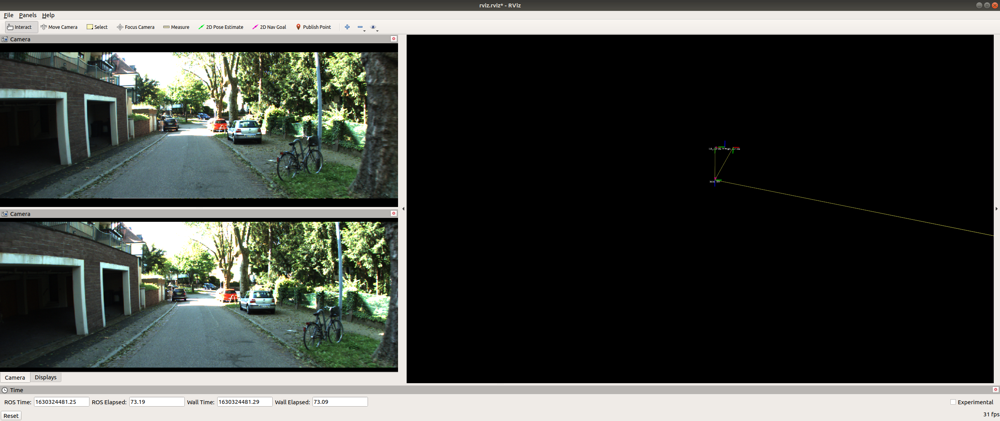

# Kitti360 Visualization

Ros package to visualize KITTI-360 data with RVIZ

## Getting Started:

### Data Preparation

Download the [KITTI360 dataset](https://www.cvlibs.net/datasets/kitti-360/download.php) to your computer. We support the [perspective images](https://s3.eu-central-1.amazonaws.com/avg-projects/KITTI-360/a1d81d9f7fc7195c937f9ad12e2a2c66441ecb4e/download_2d_perspective.zip), [Raw Velodyne Scans](https://s3.eu-central-1.amazonaws.com/avg-projects/KITTI-360/a1d81d9f7fc7195c937f9ad12e2a2c66441ecb4e/download_3d_velodyne.zip), [calibrations](https://s3.eu-central-1.amazonaws.com/avg-projects/KITTI-360/a1d81d9f7fc7195c937f9ad12e2a2c66441ecb4e/download_3d_velodyne.zip), [vehicle poses](https://s3.eu-central-1.amazonaws.com/avg-projects/KITTI-360/89a6bae3c8a6f789e12de4807fc1e8fdcf182cf4/data_poses.zip). 

Ended up as : KITTI-360/{calibration/data_2d_raw/data_3d_raw/data_poses}.

Overwrite the folder names in the launch file to your data.

### Software Prerequisite

This repo runs with ROS python3 (noetic), and we expect PyQt5 correctly setup with ROS installation.

Clone the repo under the {workspace}/src/ folder. Overwrite the folder names in the [launch file](./launch/visualize_launch.launch) to point to your data. 

```bash
cd catkin_ws/src
git clone https://github.com/Owen-Liuyuxuan/kitti_visualize
cd ..
source devel/setup.bash # devel/setup.zsh or devel/setup.sh for your own need.

# modify and check the data path!! Also control the publishing frequency of the data stream.
nano src/kitti_visualize/launch/visualize_launch.launch 

# this will launch the data publisher / rviz / GUI controller
roslaunch kitti_visualize visualize_launch.launch 
```


### Core Features:

- [x] KITTI-360 raw data sequence support. 
- [x] Stereo RGB cameras.
- [x] LiDAR, RGB point clouds.
- [x] TF-tree (camera and LiDAR).
- [x] GUI control & ROS topic control.


## GUI



### User manual:

    index: integer selection notice do not overflow the index number.

    Stop: stop any data loading or processing of the visualization node.
    
    Pause: prevent pointer of the sequantial data stream from increasing, keep the current frame.

    Cancel: quit. (click this before killing the entire launch process)

## Raw Data & Depth Prediction Dataset

We support video-like streaming raw data. Depth Prediction dataset follows similar structure of raw data, thus can be visualized in RGB point clouds together(optionally). 



### ROS Topics

/kitti360/left_camera/image ([sensor_msgs/Image](http://docs.ros.org/en/api/sensor_msgs/html/msg/Image.html))

/kitti360/right_camera/image ([sensor_msgs/Image](http://docs.ros.org/en/api/sensor_msgs/html/msg/Image.html))

/kitti360/left_camera/camera_info ([sensor_msgs/CameraInfo](http://docs.ros.org/en/api/sensor_msgs/html/msg/CameraInfo.html))

/kitti360/right_camera/camera_info ([sensor_msgs/CameraInfo](http://docs.ros.org/en/api/sensor_msgs/html/msg/CameraInfo.html))

/kitti360/lidar ([sensor_msgs/PointCloud2](http://docs.ros.org/en/melodic/api/sensor_msgs/html/msg/PointCloud2.html))

The tf trees are also well constructed. We have a predefined rviz file for visualizing all topics and tf trees.